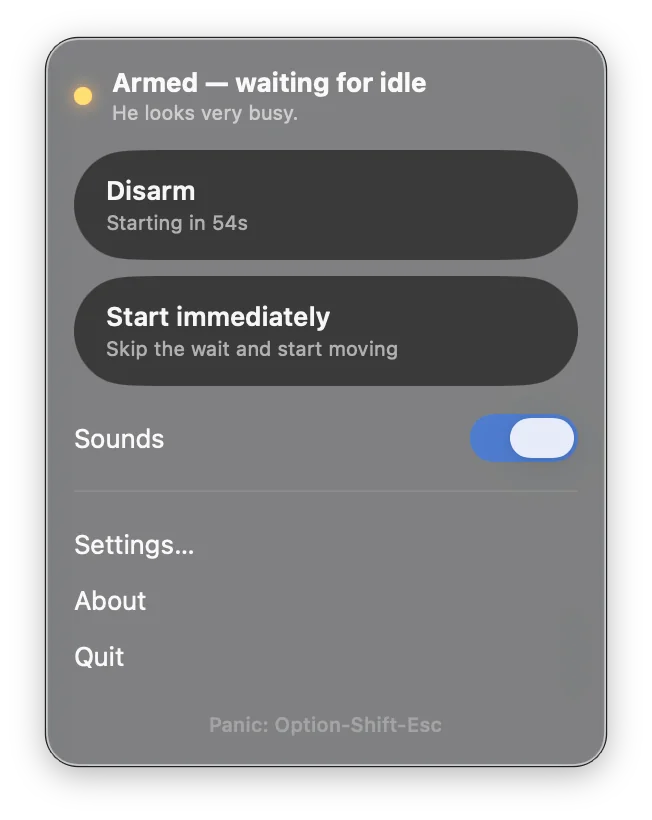

# George Is Looking Busy

He looks very busy.

[Download the beta](https://github.com/olivermaerz/george/releases)

**Website:** [george.olivermaerz.com](https://george.olivermaerz.com/)

A macOS menu bar app that simulates mouse and keyboard activity so you look busy. George waits until you are idle, then wanders the cursor, optionally clicks targets you pick, and can paste phrases you configure.

## Requirements

- macOS 14 or later
- Accessibility permission (System Settings → Privacy & Security → Accessibility)

## Build

Open `George.xcodeproj` in Xcode and run the George scheme.

## Usage

1. Grant Accessibility, then relaunch George Is Looking Busy.
2. Arm it from the menu bar extra. George starts after the idle timeout (or immediately if you choose).
3. Panic hotkey: Option-Shift-Esc.

## License

George Is Looking Busy is released under the [MIT License](LICENSE).
